# Vault Agent PKI Demo - Mermaid Diagrams

## Overview: `make agent-demo` Workflow

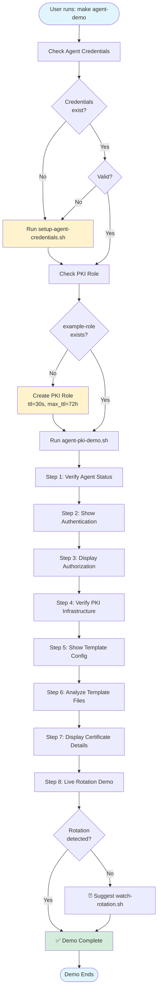

## Container Architecture

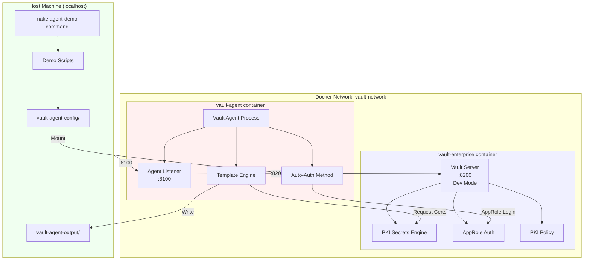

## Credential Setup Flow

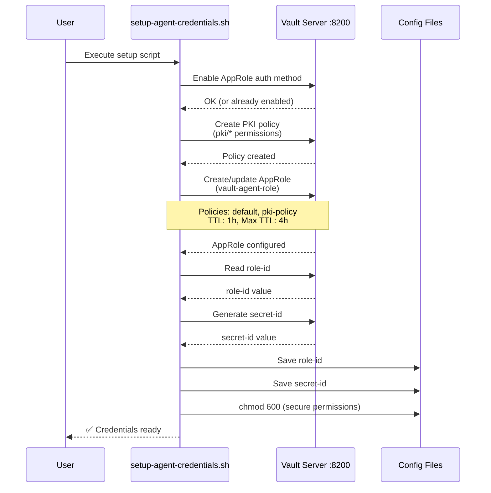

## Vault Agent Auto-Auth and Certificate Lifecycle

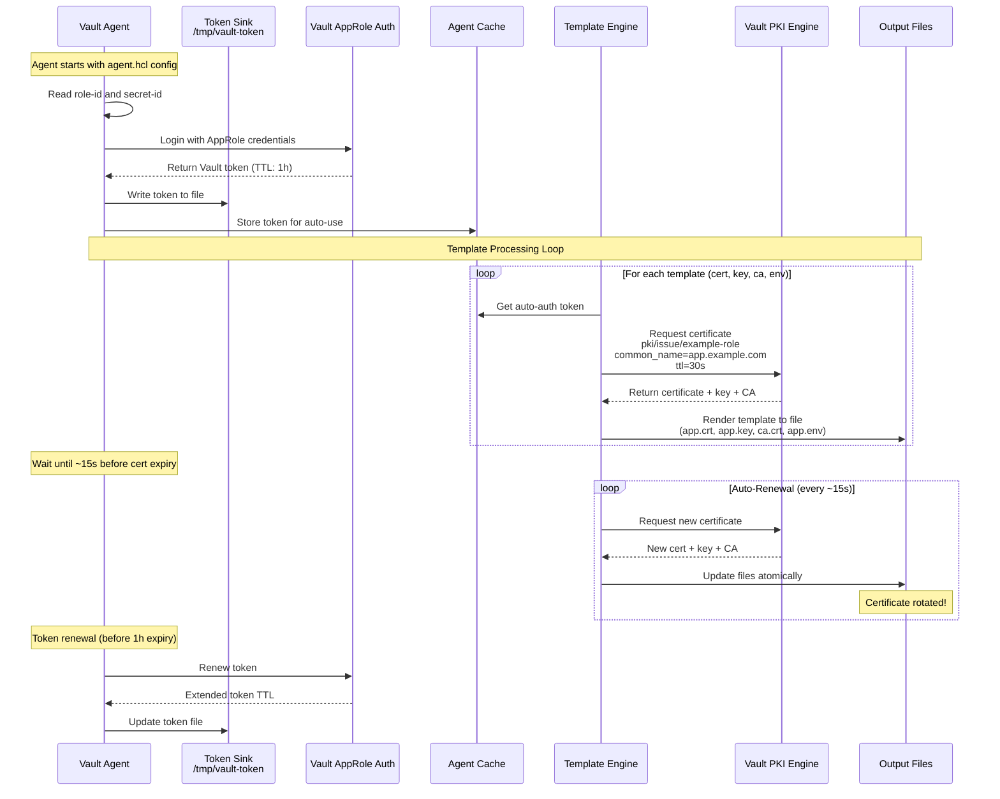

## Template Processing Detail

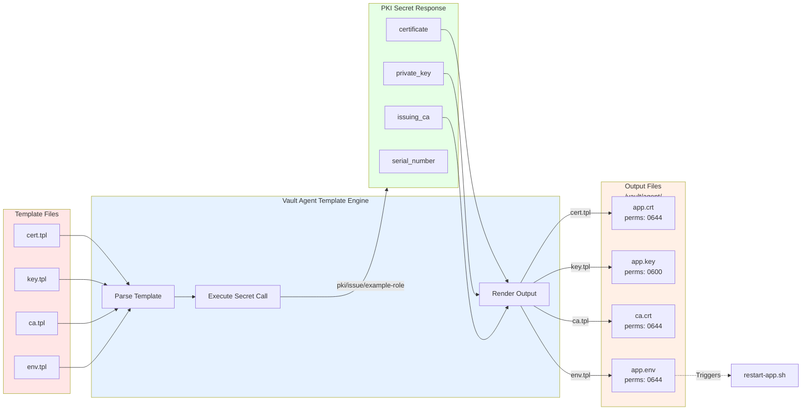

## Certificate Rotation Timeline

```mermaid
gantt
    title Certificate Lifecycle (30-second TTL)
    dateFormat ss
    axisFormat %Ss
    
    section Certificate 1
    Cert Valid          :active, cert1, 00, 30s
    Renewal Window      :crit, renew1, 15, 15s
    
    section Certificate 2
    Cert Valid          :active, cert2, 30, 30s
    Renewal Window      :crit, renew2, 45, 15s
    
    section Certificate 3
    Cert Valid          :active, cert3, 60, 30s
    Renewal Window      :crit, renew3, 75, 15s
```

## Demo Steps Flow

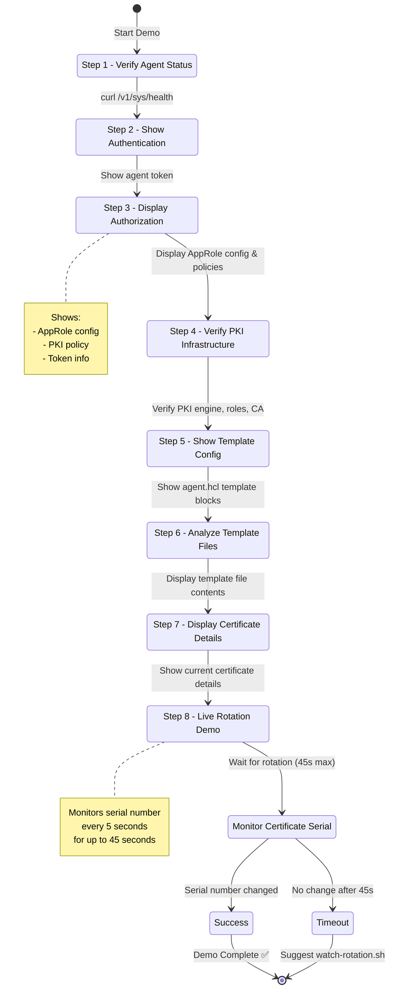

## Security and Authorization Model

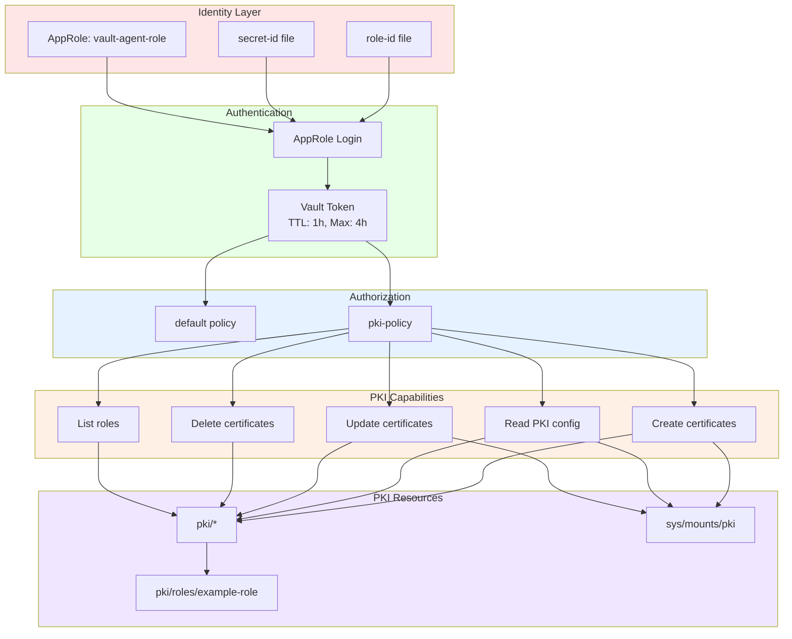

## Software Component Architecture

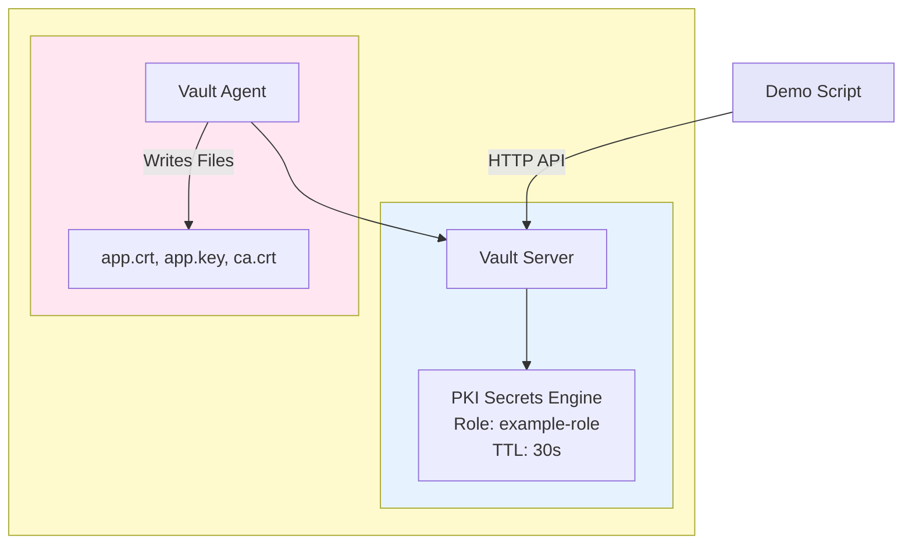

## Data Flow: Certificate Request to File

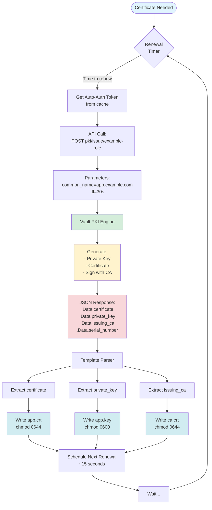

## Component Interaction Overview

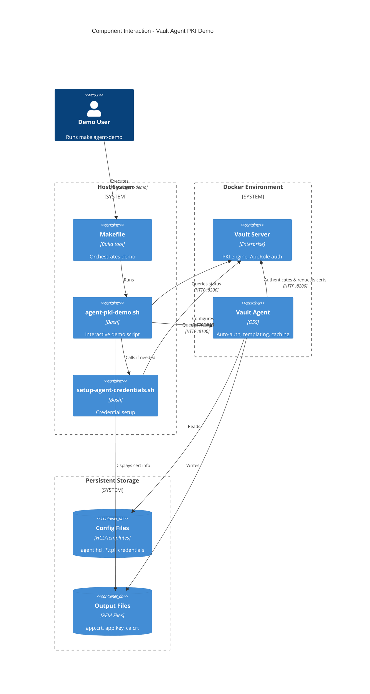

## Error Handling and Recovery

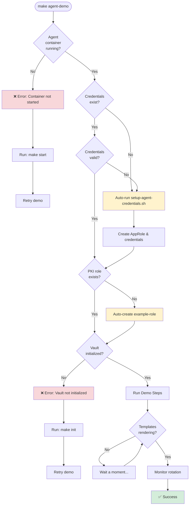

---

## Summary

The `make agent-demo` command demonstrates HashiCorp Vault Agent's automatic PKI certificate management with the following key features:

1. **Automated Setup**: Checks and creates necessary credentials and PKI roles
2. **AppRole Authentication**: Agent authenticates using role-id and secret-id
3. **Template-Based Cert Management**: Automatically generates and rotates certificates using templates
4. **Short-Lived Certificates**: 30-second TTL for demonstration purposes
5. **Automatic Renewal**: Agent renews certificates ~15 seconds before expiry
6. **Live Monitoring**: Demonstrates rotation detection in real-time

The demo showcases enterprise-grade certificate lifecycle management without manual intervention.
