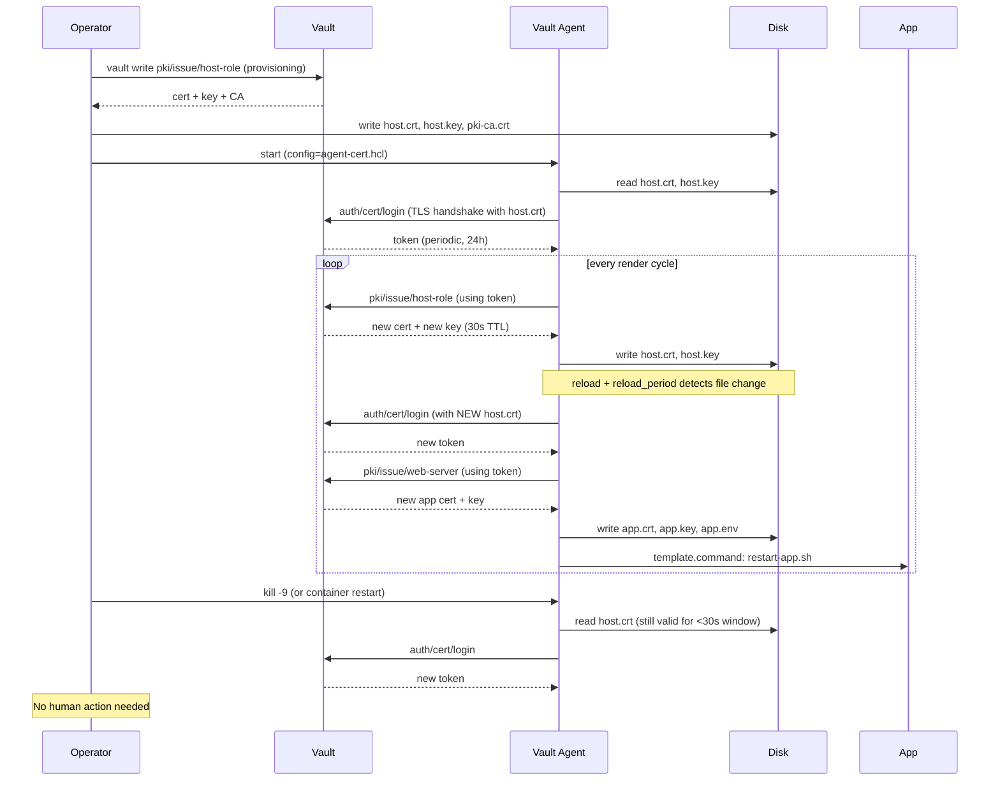

# Design Doc — Cert-auth variant for Vault Agent demo

> Status: Draft for review (Larry, 2026-05-25)
> Companion: `gitlab-ci-provisioning-design.md` (sibling) — covers steps 1–2 of the end-to-end flow (CI provisioning via mock OIDC). This doc covers steps 3–6 (agent runtime).
> Demo runbook: `demos.md` (sibling) — operator-facing walkthrough of both variants.
> Motivation: the recommended pattern for bare-metal Vault Agent deployments is TLS cert auth + agent-driven self-rotation; the existing demo uses AppRole + static secret_id, so we currently have no live demo of the recommended pattern.

## Goal

Add a **second, parallel demo variant** to `~/work/hashicorp/pki/` that shows:

1. Vault Agent authenticating to Vault via **TLS client certificate** (`auto_auth { method "cert" }`), not AppRole.
2. The agent **rotating its own client cert** by rendering a fresh one via a `template` stanza pointed at the Vault PKI engine.
3. The agent picking up the new cert and re-authenticating **without restart and without human intervention**, using `reload` + `reload_period` + `enable_reauth_on_new_credentials`.
4. The existing application-cert rotation story (templates → `app.crt`, `app.key`, `app.env` → app restart) preserved on top, so the demo still tells the same end-to-end PKI story.

Non-goals:

- Replacing the existing AppRole demo. It stays, because it's still the right starting point for many customers and the side-by-side comparison is itself valuable.
- Implementing the ACME / `pki_external_ca` flow. Different mechanism, not the recommended pattern here.
- Production-hardening (CRL automation, monitoring, alerting). Demo-grade only.

## End-to-end flow (numbered, reviewed 2026-05-26)

This is the lifecycle the demo is meant to *embody*. Steps 1–2 are simulated in `provision-host-cert.sh` (the GitLab CI job, simulated); steps 3–6 are what the running agent actually does.

1. **Provisioning (GitLab CI, once per host)** — CI job authenticates to Vault via JWT auth using `CI_JOB_JWT_V2`. Vault validates against GitLab's JWKS, checks `bound_claims` (project_path, branch, ref_protected), returns a short-lived token (5–10 min) scoped to `pki/issue/host-bootstrap-role`.

2. **Bootstrap cert issuance** — CI uses that token to call `pki/issue/host-bootstrap-role` for a long-TTL bootstrap cert (e.g. 24h — long enough to outlast the gap between CI finishing and the agent first reading the file). CI drops `host.crt`, `host.key`, `pki-ca.crt` onto the target host at well-known paths with correct ownership/perms.

3. **First agent start** — systemd (or Podman) starts the agent. Agent reads `host.crt`/`host.key`, calls `auth/cert/login`, receives a periodic token (24h, renewable indefinitely).

4. **Steady-state self-rotation (in-agent loop)** — Using the periodic token, the agent's `template` stanza calls `pki/issue/host-role` for a short-TTL renewal cert. Cert+key written to the same paths. `reload + reload_period` detects file change. `enable_reauth_on_new_credentials` triggers immediate re-auth with the new cert. Loop continues.

5. **Token renewal (parallel)** — Agent calls `auth/token/renew-self` before the periodic token expires. Independent of cert rotation.

6. **Reboot survival** — Cert/key persist on disk (NOT tmpfs). On reboot, agent re-reads them, calls `auth/cert/login` again, resumes the loop. No CI involvement provided the on-disk cert hasn't expired during downtime.

**Two sizing decisions** hidden in this flow:
- Bootstrap cert TTL > renewal cert TTL (CI cert must outlast provisioning gap; agent's own certs can be short).
- Renewal cert TTL > worst-case planned outage (reboot survival depends on the on-disk cert being valid at restart).

For the demo, we collapse step 1–2 into `provision-host-cert.sh` using the root token. Optionally (see Option 2 below), we can add a mock OIDC provider + `ci-simulator` container to demonstrate the JWT/OIDC handshake honestly.

## Why this is harder than it looks (chicken-and-egg)

The agent rotates its own cert by **using its own token** to call `pki/issue/...`. But on **first start** the agent has no token, because it has no cert yet to authenticate with. Something must issue the **initial** cert out-of-band.

In a real deployment this is GitLab CI provisioning the host. For a demo we'll do the same job from a Makefile target, but the design must make it obvious that:

- The initial-cert step is **provisioning-time only** (runs once per host).
- Every subsequent cert rotation is **agent-driven** (no `vault` CLI calls outside the agent).

We'll lean on this distinction in narration. Conflating the two would defeat the point.

## Demo flow (operator-visible)

```
make setup-cert         # one-time: provision initial host cert + cert auth role
make agent-demo-cert    # start the agent in cert-auth mode, watch it rotate itself
make watch-cert-rotation
```

In one terminal:

```
make agent-demo-cert
```

In a second terminal, the watcher loop prints whenever the agent's **own client cert** changes:

```
[T+00s] Agent cert serial: 12:ab:34... NotAfter: 2026-05-25T13:00:30Z
[T+25s] Agent cert serial: 12:ab:34... NotAfter: 2026-05-25T13:00:30Z
[T+30s] Agent cert serial: 9f:c1:de... NotAfter: 2026-05-25T13:01:00Z   <-- ROTATED
[T+30s] Agent re-authenticated (token accessor 7e:33:...)
```

The narrative beats:

1. "Here's the host cert that GitLab dropped at provision time" (`ls`, `openssl x509 -noout -dates`).
2. "Agent starts. `auto_auth { method 'cert' }` reads that file, logs in, gets a token."
3. "Agent now uses its token to render a new copy of its own cert via the `template` stanza, 30s TTL."
4. "Watch — the cert file changes serial. Agent detects it via `reload` + `reload_period`. `enable_reauth_on_new_credentials` triggers an immediate re-auth. Token accessor changes."
5. "And — crucially — kill the agent container and bring it back. Cert is still on disk. Agent re-auths. No human action."

That last beat is the punchline.

## Components to build

### 1. Vault setup additions (extend `vault-init.sh`, or new `vault-init-cert.sh`)

Decision: **new script**, `vault-init-cert.sh`, sourced/called by `make setup-cert`. Keep `vault-init.sh` untouched so the AppRole variant remains the default and the cert variant is opt-in. Reduces risk of breaking existing rehearsals.

New script adds:

- Enable `auth/cert` method:
  ```bash
  vault auth enable cert
  ```
- A new PKI role for **host certs** (separate from `web-server` which issues app certs). Reason: different domain (`*.trading.demo.internal`) and different TTL profile (host cert: 30s for demo theatre; app cert: 30s already).
  ```bash
  vault write pki/roles/host-role \
      allowed_domains="trading.demo.internal" \
      allow_subdomains=true \
      max_ttl="60s" \
      ttl="30s"
  ```
- A cert-auth role bound to the PKI CA, so any cert signed by it for `*.trading.demo.internal` can authenticate:
  ```bash
  vault write auth/cert/certs/host-role \
      display_name=host-role \
      policies=pki-policy-host \
      certificate=@/tmp/pki-ca.crt \
      allowed_common_names="*.trading.demo.internal" \
      token_period=24h
  ```
- A scoped policy `pki-policy-host` that grants the agent the right to **re-issue its own cert** and **issue app certs**:
  ```hcl
  path "pki/issue/host-role"     { capabilities = ["create","update"] }
  path "pki/issue/web-server"  { capabilities = ["create","update"] }
  path "auth/token/renew-self"   { capabilities = ["update"] }
  path "auth/token/lookup-self"  { capabilities = ["read"] }
  ```
  (Yes, the agent issues both its own auth cert *and* the application cert. That's the same agent doing two template renders.)

### 2. Initial cert provisioning (new script `provision-host-cert.sh`)

Runs **once** per `make setup-cert`. Mimics the GitLab CI step:

```bash
vault write -format=json pki/issue/host-role \
    common_name="host-01.trading.demo.internal" \
    ttl=30s \
    > /tmp/host-issue.json

jq -r .data.certificate    /tmp/host-issue.json > vault-agent-config/host.crt
jq -r .data.private_key    /tmp/host-issue.json > vault-agent-config/host.key
jq -r .data.issuing_ca     /tmp/host-issue.json > vault-agent-config/pki-ca.crt

chmod 600 vault-agent-config/host.key
chmod 644 vault-agent-config/host.crt vault-agent-config/pki-ca.crt
```

Demo narration explicitly calls this out as "the GitLab job, simulated."

### 3. New agent config `vault-agent-config/agent-cert.hcl`

```hcl
pid_file = "/tmp/pidfile-cert"

vault {
  address = "http://vault:8200"
}

auto_auth {
  method "cert" {
    mount_path = "auth/cert"
    config = {
      name          = "host-role"
      ca_cert       = "/vault/config/pki-ca.crt"
      client_cert   = "/vault/config/host.crt"
      client_key    = "/vault/config/host.key"
      reload        = true
      reload_period = "5s"   # tight for demo theatre; production: 1m default
    }

    enable_reauth_on_new_credentials = true
  }

  sink "file" {
    config = {
      path = "/tmp/vault-token-cert"
    }
  }
}

cache {
  use_auto_auth_token = true
}

# The agent re-issues its own client cert into the same files it auth'd with.
# Loop closes: render -> reload detects file change -> reauth with new cert.
template {
  source      = "/vault/config/host-cert.tpl"
  destination = "/vault/config/host.crt"
  perms       = 0644
}

template {
  source      = "/vault/config/host-key.tpl"
  destination = "/vault/config/host.key"
  perms       = 0600
}

# Plus the existing application cert rotation (unchanged).
template {
  source      = "/vault/config/cert.tpl"
  destination = "/vault/agent/app.crt"
  perms       = 0644
}

template {
  source      = "/vault/config/key.tpl"
  destination = "/vault/agent/app.key"
  perms       = 0600
}

template {
  source      = "/vault/config/ca.tpl"
  destination = "/vault/agent/ca.crt"
  perms       = 0644
}

template {
  source      = "/vault/config/env.tpl"
  destination = "/vault/agent/app.env"
  perms       = 0644
  command     = "/bin/sh /vault/config/restart-app.sh"
}
```

### 4. New template files

`vault-agent-config/host-cert.tpl`:

```
{{- with secret "pki/issue/host-role" "common_name=host-01.trading.demo.internal" "ttl=30s" -}}
{{ .Data.certificate }}
{{- end -}}
```

`vault-agent-config/host-key.tpl`:

```
{{- with secret "pki/issue/host-role" "common_name=host-01.trading.demo.internal" "ttl=30s" -}}
{{ .Data.private_key }}
{{- end -}}
```

**Risk to mitigate**: rendering cert and key as *two separate templates pointed at two separate `pki/issue` calls* means each render mints a **brand-new keypair on the Vault server side**. Call 1 returns cert A + key A; call 2 returns cert B + key B. `host.crt` ends up with cert A, `host.key` ends up with key B. The cert's `subjectPublicKeyInfo` no longer matches the private key on disk → next `auth/cert/login` fails with "private key does not match certificate" → agent dies. Template engine does NOT dedupe `pki/issue/*` calls because they are write-on-read (each call legitimately produces a new artifact).

**Resolution**: three approaches, ranked by simplicity. We won't know which one we need until we run the smoke test below.

**Approach A — single template, combined PEM bundle (simplest if it works):**

```hcl
# host-bundle.tpl
{{- with secret "pki/issue/host-role" "common_name=host-01..." "ttl=30s" -}}
{{ .Data.certificate }}
{{ .Data.private_key }}
{{- end -}}
```

Then in `agent-cert.hcl`:

```hcl
auto_auth {
  method "cert" {
    config = {
      client_cert = "/vault/config/host-bundle.pem"
      client_key  = "/vault/config/host-bundle.pem"   # same file
      ...
    }
  }
}
```

One render → one keypair → cert and key match by construction. Whether Vault Agent accepts the same path for both options is the unknown.

**Approach B — single template renders JSON, `command` splits atomically (safe fallback):**

```hcl
# host-bundle.tpl — render full JSON
{{- with secret "pki/issue/host-role" "common_name=host-01..." "ttl=30s" -}}
{{ . | toJSON }}
{{- end -}}

# Template stanza
template {
  source      = "/vault/config/host-bundle.tpl"
  destination = "/vault/config/host-bundle.json"
  command     = "/vault/config/split-bundle.sh"
}
```

`split-bundle.sh`:

```bash
#!/bin/sh
set -euo pipefail
jq -r .data.certificate /vault/config/host-bundle.json > /vault/config/host.crt.new
jq -r .data.private_key /vault/config/host-bundle.json > /vault/config/host.key.new
chmod 644 /vault/config/host.crt.new
chmod 600 /vault/config/host.key.new
mv /vault/config/host.crt.new /vault/config/host.crt   # atomic rename
mv /vault/config/host.key.new /vault/config/host.key   # atomic rename
```

The `.new` + `mv` pattern is **mandatory**: POSIX rename is atomic, plain write is not. Without this, the agent's `reload` watcher can catch a half-written file between the cert and key writes and `auth/cert/login` fails on a malformed input. (Also addresses Risk #2.)

**Approach C — two templates, shared secret variable:**

Looks tempting:

```
{{ $issue := secret "pki/issue/host-role" "common_name=..." "ttl=30s" }}
{{ $issue.Data.certificate }}
```

But the `$issue` variable scope is **single-template**. Two destination files means two `{{ with secret }}` (or two variable assignments) and you're back to two `pki/issue` calls. Approach C doesn't actually solve the problem — listed only to head off "but what about variables?"

**5-minute smoke test before committing to either A or B:**

```bash
# 1. Issue one cert+key by hand using the existing pki/issue endpoint
vault write -format=json pki/issue/host-role \
    common_name="host-01.trading.demo.internal" ttl=5m \
    > /tmp/test-issue.json

# 2. Build a combined PEM bundle (Approach A shape)
jq -r .data.certificate /tmp/test-issue.json > /tmp/test-bundle.pem
jq -r .data.private_key /tmp/test-issue.json >> /tmp/test-bundle.pem
jq -r .data.issuing_ca  /tmp/test-issue.json > /tmp/test-ca.pem

# 3. Try cert auth login with client_cert AND client_key pointing at the same file
cat > /tmp/smoke-agent.hcl <<EOF
vault { address = "http://vault:8200" }
auto_auth {
  method "cert" {
    config = {
      name        = "host-role"
      ca_cert     = "/tmp/test-ca.pem"
      client_cert = "/tmp/test-bundle.pem"
      client_key  = "/tmp/test-bundle.pem"
    }
  }
  sink "file" { config = { path = "/tmp/smoke-token" } }
}
EOF

vault agent -config=/tmp/smoke-agent.hcl
# Watch for "auth handler: authenticating" + "renewed auth token" in logs.
# Token appearing in /tmp/smoke-token → Approach A works → use it.
# Auth handler failure → Approach A not supported → fall back to Approach B.
```

**Decision rule:**
- Token appears in the sink file within ~5s → **Approach A** is supported, use it. Simpler. Single template, no split script.
- Auth handler errors with "tls: private key does not match public key" or "open ... no such file" → **Approach B**. Add `split-bundle.sh` and the JSON-render template.

This smoke test is the **first thing to run** before writing any of the other components. The whole demo hinges on which approach we end up with: Approach A means one template file in `vault-agent-config/`; Approach B means two extra files (`split-bundle.sh` + a JSON-render template) plus a `jq` dependency in the agent container.

**Action item before coding**: run the smoke test above. Record the result in this section. Update Component 4 to the chosen approach.

### 5. Docker compose addition

New service in `docker-compose.yml` (or a `docker-compose.cert.yml` overlay):

```yaml
vault-agent-cert:
  image: hashicorp/vault:1.21.4
  container_name: vault-agent-cert
  depends_on: [vault]
  volumes:
    - ./vault-agent-config:/vault/config
    - ./vault-agent-output-cert:/vault/agent
  networks: [vault-network]
  command: vault agent -config=/vault/config/agent-cert.hcl
```

Decision: **overlay file**, not edit to base. Layered compose pattern. `make agent-demo-cert` does `podman compose -f docker-compose.yml -f docker-compose.cert.yml up -d vault-agent-cert` (engine resolved via `engine.sh`).

### 6. Makefile targets

```
setup-cert:      ## One-time setup for cert-auth variant
                 # start + vault-init + vault-init-cert + provision-host-cert

agent-demo-cert: ## Run the cert-auth variant of the agent demo

watch-cert-rotation: ## Watch the agent's own client cert rotate
```

Plus update `help:` to mention both variants.

### 7. New watcher `watch-cert-rotation.sh`

Loop: `while true; do openssl x509 -in vault-agent-config/host.crt -noout -serial -dates; sleep 5; done`, with diff detection so it only prints lines when the serial changes. Plus token accessor lookup from the sink file.

### 8. Preflight additions

`demo-preflight.sh` needs to check:

- `auth/cert` is enabled
- `pki/roles/host-role` exists
- Initial `host.crt`, `host.key`, `pki-ca.crt` are present and not expired
- The cert chains to the Vault PKI CA

Gate `make live-demo-cert` (new) and `make agent-demo-cert` behind these checks.

## Sequence diagram (intended runtime behaviour)



## Risks and unknowns

| # | Risk | Likelihood | Mitigation |
|---|---|---|---|
| 1 | Combined cert+key vs split files (see Component 4) | High | Verify against docs before coding; have split-script fallback ready |
| 2 | Race: cert file partially written when `reload` fires, agent reads malformed cert | Medium | Render cert to `host.crt.new`, then `template.command` moves into place atomically |
| 3 | 30s TTL too tight for demo — agent may fail to renew before expiry under host load | Low–Medium | Increase to 60s if observed; or 90s with 30s render cadence |
| 4 | `enable_reauth_on_new_credentials` placement in HCL — top-level of method block vs nested in config? | Medium | Per docs, top-level of `method` (sibling of `config`). Lock down with a smoke test before main coding. |
| 5 | Cert auth role uses CA-pinned trust — if PKI CA rotates, all hosts must re-enrol | Low | Out of demo scope. Note as production consideration. |
| 6 | First cert TTL expires before agent finishes first template render → bootstrap fails | Medium | Provision initial cert with a longer TTL (e.g. 5 min) than the rotation TTL. Document this clearly. |
| 7 | `client_key` permissions — agent container may run as non-root and fail to read 0600 file owned by host user | Medium | Match `chown` in `provision-host-cert.sh` to the agent container user, or run a `chmod 644` on the key for demo simplicity (call out that 0600 is the production posture) |

## What this proves (the talking points)

- Agent **does** drive its own cert rotation end-to-end, using documented primitives (`template` + `reload` + `enable_reauth_on_new_credentials`). We're not promising a feature that doesn't exist.
- Reboot survivability: cert file on disk → agent re-auths on restart, no GitLab dependency at boot.
- Provisioning is a one-time event, not a per-reboot event.
- Same agent cleanly drives **two** PKI cycles: its own auth cert, and the application's TLS cert.

## What this explicitly does NOT prove

- That this is production-ready at exchange-grade scale. Demo is single host, dev-mode Vault, no HA, no monitoring.
- That the initial cert can be issued without **any** centralised trust (it can't — GitLab/Ansible/Packer is the secret-zero anchor).
- That cert rotation works through a multi-hour Vault outage (it doesn't, if cert TTL is shorter than outage). Sizing is the customer's call.

## Open questions for Larry before coding

1. **30s cert TTL** for the host cert — is that the right demo cadence, or do we want a slower (e.g. 2-minute) rotation to make the narrative breathable in a live presentation?
2. **Should the cert-auth variant fully replace the AppRole variant in `make live-demo`**, or stay as a separate `make live-demo-cert` path? I lean toward keeping both and adding a side-by-side comparison slide.
3. **Branding** — `host-role` / `host-01.trading.demo.internal`. OK as-is, or rename to something more generic so the demo is reusable for other audiences?
4. **Combined PEM vs split files** — see Risk #1. Will verify against docs as the very first coding step. If you have prior knowledge, would save a round trip.

## Implementation order

Once the design is approved:

1. Verify Risk #1 (combined vs split PEM) and Risk #4 (`enable_reauth_on_new_credentials` placement) against docs and with a minimal smoke test.
2. Write `vault-init-cert.sh` and verify cert auth login works manually with a hand-issued cert.
3. Write `provision-host-cert.sh`.
4. Write templates (`host-cert.tpl`, `host-key.tpl` or combined).
5. Write `agent-cert.hcl`.
6. Wire up the compose overlay and Makefile targets.
7. Write `watch-cert-rotation.sh`.
8. Extend `demo-preflight.sh`.
9. Dry-run the full demo flow start to finish.
10. Update `README.md` and the obsidian prep note to point at the new variant.

Estimate: 60–90 minutes if Risks #1 and #4 land cleanly. Add 30 minutes if the combined-PEM path doesn't work and we need the split-script fallback.
