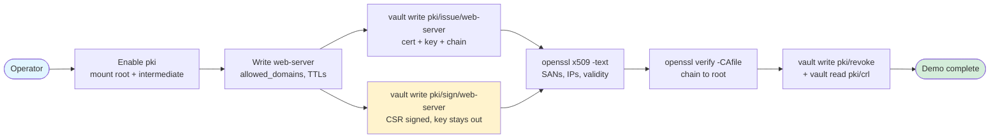
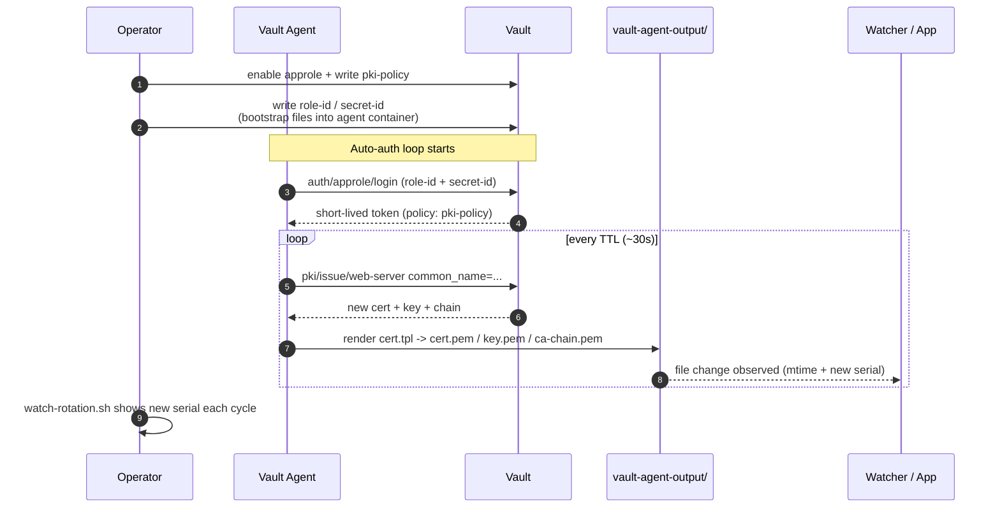
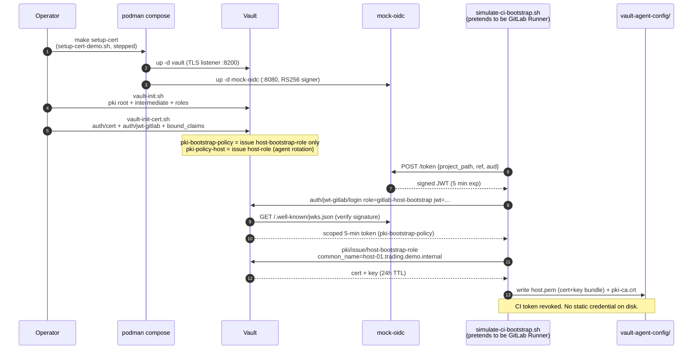
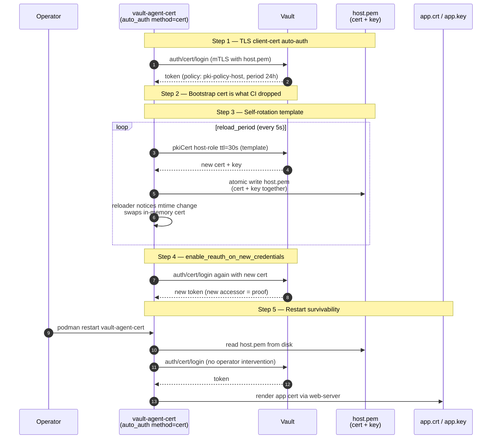
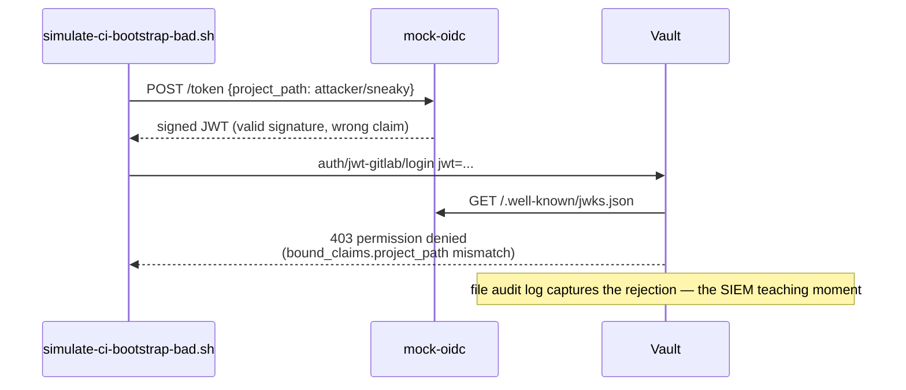
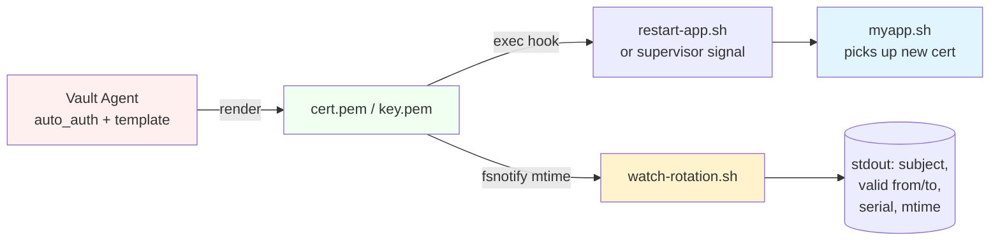

# Demo Sequences and Scenarios

This document collects the demo walkthroughs offered by this repo. The top-level [README](../README.md) covers setup and commands; this file is the scenario script — what each demo shows, what story to tell, and which Make targets drive it.

For the underlying GitLab CI / JWT-auth bootstrap design used by the cert-auth variant, see [gitlab-ci-provisioning-design.md](gitlab-ci-provisioning-design.md). For diagrams, see [../agent-demo-diagrams.md](../agent-demo-diagrams.md).

## Audience-track entrypoints

```bash
make live-demo        # short narrative flow for a live presentation
make workshop-demo    # self-serve sequence for hands-on learners
make operator-demo    # AppRole, templates, and rotation-focused walkthrough
make live-demo-cert   # cert-auth Agent variant (guided 5-step walkthrough)
```

These guided entrypoints frame the repo as one story with three audience-specific paths:

- the operator establishes trust and policy
- the machine consumes short-lived certificates through Vault Agent
- optional application/process demos show what rotation looks like in practice

## Traditional PKI demo

```bash
make demo
```

Covers:

- root and intermediate CA creation
- PKI role configuration
- leaf certificate issuance with SANs and IP SANs
- CSR-based signing where the private key stays outside Vault
- certificate inspection with OpenSSL
- certificate chain verification
- revocation and CRL inspection



## Vault Agent rotation demo (AppRole)

```bash
make agent-demo
```

Covers:

- AppRole-based Agent authentication
- least-privilege Agent policy scoped to certificate issuance plus token self-management
- template-driven certificate generation
- 30-second TTL demo certificates
- automatic certificate rotation
- local file rendering for cert, key, and CA chain
- full-file walkthrough of [vault-agent-config/agent.hcl](../vault-agent-config/agent.hcl) and [vault-agent-config/cert.tpl](../vault-agent-config/cert.tpl)



For the full step-by-step flow and container topology of this demo, see [../agent-demo-diagrams.md](../agent-demo-diagrams.md).

## Vault Agent cert-auth rotation demo

```bash
make setup-cert
make live-demo-cert
make watch-cert-rotation   # optional, in another terminal
```

`make live-demo-cert` is the audience-facing entrypoint. Under the hood it runs `preflight-cert`, then `agent-demo-cert`, then [`./agent-cert-demo.sh`](../agent-cert-demo.sh), which steps through the config snippets relevant to each phase with pauses between steps.

### Setup-cert flow (provisioning, runs once)



### Live-demo-cert flow (agent runtime, repeats forever)



### Negative path: provision-host-bad-claim



This path starts Vault with the development TLS listener because Vault's `auth/cert` method requires client certificates on the TLS connection. It runs alongside the other demos without changing them.

### What the 5-step walkthrough shows

1. **`auto_auth { method "cert" }`** — show the relevant block in [agent-cert.hcl](../vault-agent-config/agent-cert.hcl) and the `auth/cert/certs/host-role` trust anchor pinned to the PKI CA.
2. **Bootstrap host certificate** — show the `host-role` PKI role, re-run [`provision-host-cert.sh`](../provision-host-cert.sh) with a 60s TTL so rotation is visible within the demo window, restart `vault-agent-cert`, then inspect the issued `host.pem` (serial + token accessor captured as `INITIAL_*`).
3. **Self-rotation template** — show [host-bundle.tpl](../vault-agent-config/host-bundle.tpl) and the `template` stanza in `agent-cert.hcl`; narrate the 4-stage rotation (template renders new cert/key → Agent writes bundle → `reload_period` picks it up → Agent re-authenticates).
4. **Watch rotation** — poll for ~90s; on rotation the script prints the new serial and the new token accessor, proving the Agent re-issued its own host credential and re-authenticated.
5. **Restart survivability** — `podman restart vault-agent-cert` (or `docker` if the engine fallback is active), then verify the new accessor proves the Agent re-authenticated from the on-disk bundle without operator intervention.

### Bootstrap (CI simulation)

The initial host certificate is provisioned by [`simulate-ci-bootstrap.sh`](../simulate-ci-bootstrap.sh), which models a GitLab CI job:

1. asks the local mock OIDC issuer (`mock-oidc` container) for a signed `id_token`
2. exchanges that token at `auth/jwt-gitlab/login` for a short-lived Vault token scoped to `pki-bootstrap-policy`
3. uses that token to mint exactly one host certificate

**No Vault root token, no static client secret leaves the build pipeline.** After bootstrap, the Agent's own host cert is its only credential. Rotation is fully Agent-driven.

Useful follow-up targets:

```bash
make provision-host             # mint a fresh host.pem via the simulated CI
make provision-host-bad-claim   # negative test: a wrong-project JWT is denied
make show-bootstrap-cert        # inspect the current bootstrap cert
make mock-oidc-logs             # tail the mock OIDC issuer
```

The full bootstrap design lives in [gitlab-ci-provisioning-design.md](gitlab-ci-provisioning-design.md).

### Things this variant proves

- TLS client-certificate authentication with `auto_auth { method "cert" }`
- one-time provisioning of the initial host certificate, simulating CI enrolment
- agent-driven re-issuance of its own host credential via a template
- immediate re-authentication when the credential changes
- restart survivability: the Agent can re-authenticate from the certificate bundle on disk

## Process supervisor demo

```bash
make process-demo
```

Extends the Agent demo by showing how an application can react to certificate changes. The rotation watcher output highlights the fields most useful for a live audience:

- certificate subject
- `Valid from` and `Expires` timestamps
- certificate serial number
- matching certificate/key file modification times



**Story beat:** new cert lands on disk → agent's `exec` (or external watcher) triggers the supervisor → app reloads with the new identity. The watcher panel proves the cert really changed (new serial + new mtime) instead of looking like a no-op.
