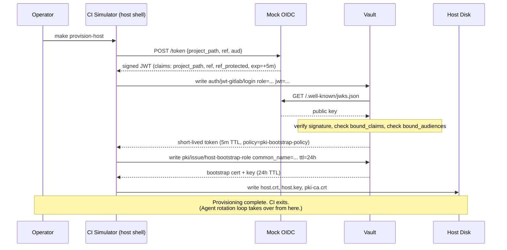
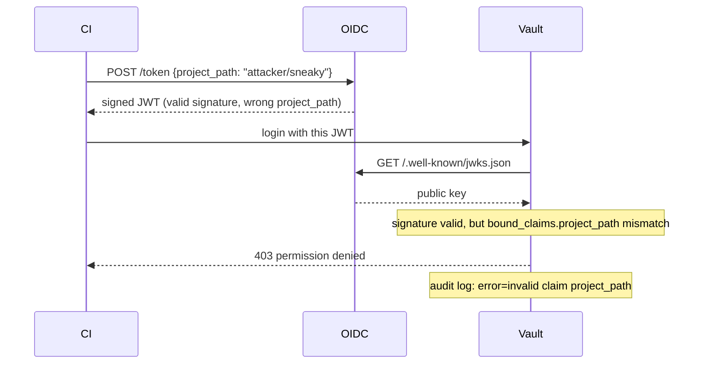

# Design Doc — GitLab CI provisioning (mock OIDC) for cert-auth bootstrap demo

> Status: Draft for review (Larry, 2026-05-26)
> Extends: `cert-auth-variant-design.md` (sibling)
> Demo runbook: `demos.md` (sibling) — operator-facing walkthrough.
> Scope decisions (locked 2026-05-26): mock OIDC provider (not real GitLab CE); cert-auth bootstrap only

## Goal

Add a credible **provisioning-time** layer to the cert-auth variant of the PKI demo, demonstrating:

1. How a CI job (GitLab in production, simulated here) acquires the right to issue a host's **bootstrap cert** without holding any static Vault credential.
2. How Vault's JWT auth method enforces **bound claims** so only the intended pipeline can mint bootstrap certs.
3. The clean lifecycle separation: **CI mints the bootstrap cert once; the agent self-rotates from then on.**
4. A live negative test — present a JWT with the wrong `project_path` and watch Vault reject it. Strong teaching moment (the GitLab admin team needs to internalise that "bound_claims is the security boundary").

This design covers **steps 1–2 of the end-to-end flow** in `cert-auth-variant-design.md`. It does not change steps 3–6 (agent runtime).

## Non-goals

- Running real GitLab CE locally. Decided against on resource/boot-time grounds; mock OIDC is enough to demonstrate the pattern.
- Production hardening of the mock OIDC provider (key rotation, JWKS cache, etc.).
- Showing GitLab Runner internals (job scheduling, executors). The CI step is just "a process that has a JWT and calls Vault."

## Why mock OIDC instead of real GitLab CE

| Concern | Real GitLab CE | Mock OIDC |
|---|---|---|
| RAM cost | ~4–8 GB | <50 MB |
| Boot time | 3–5 min | <2 s |
| Setup complexity | Server + runner registration + project setup + pipeline file | One container, one config |
| Demonstrates Vault JWT auth correctly | Yes | Yes — Vault doesn't care whether JWKS comes from GitLab or our mock |
| Demonstrates GitLab-specific UI/UX | Yes | No |
| Credibility on screen | High | Medium — needs honest narration |

For the audience question ("how does the CI job authenticate to Vault without a static credential?") the mock answers it just as well as the real thing, because the Vault-side configuration (`auth/jwt-gitlab/`, bound_claims, role mapping) is identical regardless of who signs the JWT.

We will **narrate honestly**: *"In production this JWT comes from `CI_JOB_JWT_V2` in GitLab CI, signed by GitLab's OIDC provider. For the demo we're using a 30-line mock that signs JWTs with the same claim structure. Vault is configured identically either way."*

## End-to-end demo flow (operator-visible)

```
make setup-cert         # one-time: vault-init-cert + setup-mock-oidc + setup-jwt-auth
make provision-host     # simulates: gitlab CI run → JWT → vault token → bootstrap cert on disk
make agent-demo-cert    # start the agent, watch it rotate (from cert-auth-variant-design)

# Bonus teaching moment:
make provision-host-bad-claim   # same flow but with wrong project_path → Vault rejects → audit log
```

Narrated beats during `make provision-host`:

1. *"This is what the GitLab CI job does. We start a one-shot container that has nothing but a JWT signed by our mock OIDC provider."*
2. Print the JWT decoded so the audience sees the claims: `project_path: acme/trading-platform`, `ref: main`, `ref_protected: true`, `aud: vault-pki-bootstrap`.
3. *"It calls Vault's JWT auth method, which verifies the signature against the OIDC provider's JWKS and checks bound_claims."*
4. Print the Vault response: short-lived token, scoped to the `gitlab-host-bootstrap` role.
5. *"Now it uses that token to call `pki/issue/host-bootstrap-role` for a long-TTL bootstrap cert."*
6. Print the issued cert's `NotAfter` and serial.
7. *"The cert+key are dropped onto the target host with the right perms. CI's job is done. From here on, the agent rotates itself."*

Narrated beats during `make provision-host-bad-claim`:

1. *"Same flow, but the JWT claims `project_path: attacker/sneaky-repo` instead of `acme/trading-platform`."*
2. Vault returns `permission denied: invalid claims`.
3. Show the Vault audit log line — `error: bound_claim project_path mismatch`.
4. *"This is the boundary the GitLab admin team must own. Vault trusts the JWT signature; it trusts the CI pipeline only insofar as bound_claims restrict it."*

## Components to build

### 1. Mock OIDC provider (`mock-oidc/`)

A tiny container that:
- Holds an RSA keypair for signing.
- Serves three HTTP endpoints:
  - `GET /.well-known/openid-configuration` — OIDC discovery
  - `GET /.well-known/jwks.json` — public key in JWKS format
  - `POST /token` — accepts `{"project_path": "...", "ref": "...", ...}` and returns a signed JWT with those claims, `iss` set to the mock's URL, `aud` from the request, sensible `iat`/`exp` (5 min).

Implementation options:
- **Python (~50 lines)** using `python-jose` + Flask. Lightweight, easy to read.
- **Node (~30 lines)** using `jose`. Smaller image possible with Alpine.
- **Go** if we want a static binary, but overkill.

**Decision: Python**, because:
- The Vault demo audience can read it (Java/ops-heavy crowd, Python beats Node for quick read-through).
- Smaller dependency surface than a Node app for this scope.
- We can run it from a `python:3.12-alpine` base, <80 MB image.

File layout:
```
mock-oidc/
├── Dockerfile             # python:3.12-alpine + pip install
├── requirements.txt       # flask, python-jose[cryptography]
├── server.py              # the 50-line provider
└── keys/                  # generated at first start, mounted volume
    ├── signing-key.pem
    └── jwks.json          # derived from signing-key on startup
```

Endpoints:

```python
# server.py outline

@app.get("/.well-known/openid-configuration")
def discovery():
    return {
        "issuer": ISSUER_URL,
        "jwks_uri": f"{ISSUER_URL}/.well-known/jwks.json",
        "id_token_signing_alg_values_supported": ["RS256"],
    }

@app.get("/.well-known/jwks.json")
def jwks():
    return load_jwks()

@app.post("/token")
def mint_token():
    body = request.json
    claims = {
        "iss": ISSUER_URL,
        "aud": body.get("aud", "vault-pki-bootstrap"),
        "sub": f"project_path:{body['project_path']}:ref:{body['ref']}",
        "project_path": body["project_path"],
        "ref": body["ref"],
        "ref_type": body.get("ref_type", "branch"),
        "ref_protected": body.get("ref_protected", "true"),
        "iat": now(),
        "exp": now() + 300,
    }
    return {"token": sign_jwt(claims)}
```

Issuer URL: `http://mock-oidc:8080` (within the container network).

### 2. Vault JWT auth setup (extend `vault-init-cert.sh`)

Add to the cert-auth init script:

```bash
# Enable JWT auth for the simulated GitLab CI
vault auth enable -path=jwt-gitlab jwt

vault write auth/jwt-gitlab/config \
    oidc_discovery_url="http://mock-oidc:8080" \
    bound_issuer="http://mock-oidc:8080" \
    default_role="gitlab-host-bootstrap"

# The role: who can use this auth, what they get
vault write auth/jwt-gitlab/role/gitlab-host-bootstrap \
    role_type="jwt" \
    user_claim="sub" \
    bound_audiences="vault-pki-bootstrap" \
    bound_claims_type="glob" \
    bound_claims='{
      "project_path": "acme/trading-platform/*",
      "ref_type": "branch",
      "ref_protected": "true"
    }' \
    token_policies="pki-bootstrap-policy" \
    token_ttl="5m" \
    token_max_ttl="10m"
```

And the scoped policy:

```hcl
# pki-bootstrap-policy.hcl
# CI can ONLY issue bootstrap certs. It cannot renew them, cannot issue app
# certs, cannot read anything else. This is the principle of least privilege
# applied to the provisioning step.
path "pki/issue/host-bootstrap-role" {
  capabilities = ["create", "update"]
}
```

Note the **separate** PKI role `host-bootstrap-role` (long TTL) vs `host-role` (short TTL, agent-driven, from `cert-auth-variant-design.md`):

```bash
vault write pki/roles/host-bootstrap-role \
    allowed_domains="trading.demo.internal" \
    allow_subdomains=true \
    max_ttl="24h" \
    ttl="24h"
```

Two distinct roles → two distinct policies → CI can mint long-TTL bootstrap certs; agent can mint short-TTL renewal certs; **neither can do the other's job**. That separation is the audit story.

### 3. CI simulator (`ci-simulator/` or shell script)

The simulated CI job. Two implementation options:

**Option A: shell script `simulate-ci-bootstrap.sh`** (recommended)

```bash
#!/bin/bash
set -euo pipefail

PROJECT_PATH="${1:-acme/trading-platform/agent}"
REF="${2:-main}"

echo "==> [CI] Requesting JWT from mock OIDC provider for $PROJECT_PATH @ $REF"
JWT=$(curl -s -X POST http://mock-oidc:8080/token \
    -H 'content-type: application/json' \
    -d "{\"project_path\":\"$PROJECT_PATH\",\"ref\":\"$REF\",\"aud\":\"vault-pki-bootstrap\"}" \
    | jq -r .token)

echo "==> [CI] JWT claims:"
echo "$JWT" | cut -d. -f2 | base64 -d 2>/dev/null | jq .

echo "==> [CI] Exchanging JWT for Vault token via auth/jwt-gitlab/login"
VAULT_TOKEN=$(vault write -field=token auth/jwt-gitlab/login \
    role=gitlab-host-bootstrap jwt="$JWT")
export VAULT_TOKEN

echo "==> [CI] Issuing bootstrap cert via pki/issue/host-bootstrap-role"
vault write -format=json pki/issue/host-bootstrap-role \
    common_name="host-01.trading.demo.internal" ttl=24h \
    > /tmp/bootstrap-issue.json

echo "==> [CI] Bootstrap cert NotAfter: $(jq -r .data.expiration /tmp/bootstrap-issue.json \
    | xargs -I{} date -d @{})"
echo "==> [CI] Serial: $(jq -r .data.serial_number /tmp/bootstrap-issue.json)"

echo "==> [CI] Dropping cert / key / CA onto host volume (/vault/config)"
jq -r .data.certificate /tmp/bootstrap-issue.json > vault-agent-config/host.crt
jq -r .data.private_key /tmp/bootstrap-issue.json > vault-agent-config/host.key
jq -r .data.issuing_ca  /tmp/bootstrap-issue.json > vault-agent-config/pki-ca.crt
chmod 644 vault-agent-config/host.crt vault-agent-config/pki-ca.crt
chmod 600 vault-agent-config/host.key

echo "==> [CI] Done. Agent can now bootstrap."
```

Runs from the host (uses local `vault` CLI + `curl`). Talks to `mock-oidc:8080` and `vault:8200` via the container network from outside — that means either:
- Port-forward `mock-oidc` (e.g. `8080:8080`) and `vault` (already `8200:8200`), use `http://localhost:8080` from host, OR
- Run the script **inside** a container on the same container network.

**Decision: port-forward + run from host.** Simpler narration ("here's the script we'd put in `.gitlab-ci.yml`"), no extra container, matches how Larry will demo it live.

**Option B: dedicated `ci-simulator` container**

Containerised version of the same script. Useful if we want to:
- Demonstrate the CI job as a true throwaway process.
- Show the JWT being acquired inside the container (no host CLI involvement).

More setup, more honest as a "CI runner" simulation. Not worth it for v1.

### 4. Negative-test script (`simulate-ci-bootstrap-bad.sh`)

```bash
#!/bin/bash
# Same as the good one but with a project_path Vault's bound_claims rejects.

JWT=$(curl -s -X POST http://localhost:8080/token \
    -d '{"project_path":"attacker/sneaky-repo","ref":"main","aud":"vault-pki-bootstrap"}' \
    | jq -r .token)

echo "==> [CI] Attempting login with mismatched project_path..."
vault write auth/jwt-gitlab/login role=gitlab-host-bootstrap jwt="$JWT" || true

echo ""
echo "==> Vault audit log entry for this attempt:"
podman exec vault tail -5 /vault/logs/audit.log | jq 'select(.response.error != null)'
```

Vault will refuse the login with a bound_claims mismatch. The audit log entry is the teaching moment — *"This is what your SIEM sees. Any pipeline trying to mint a bootstrap cert from outside the acme/trading-platform project shows up here."*

### 5. Compose overlay addition (extend `docker-compose.cert.yml`)

Add the mock OIDC service alongside `vault-agent-cert`:

```yaml
mock-oidc:
  build: ./mock-oidc
  container_name: mock-oidc
  ports:
    - "8080:8080"
  networks: [vault-network]
  environment:
    - ISSUER_URL=http://mock-oidc:8080
  volumes:
    - ./mock-oidc/keys:/app/keys
```

Note: `ISSUER_URL=http://mock-oidc:8080` (the container-internal hostname) because **Vault must be able to fetch JWKS from that URL**, and Vault is on the same container network. The host-side script uses `http://localhost:8080` for the same service.

This means JWTs are signed with `iss=http://mock-oidc:8080` and Vault is configured to expect `bound_issuer=http://mock-oidc:8080`. Both Vault and the OIDC mock agree. The host-side `curl` doesn't care about `iss` — it just needs to reach the OIDC endpoint to fetch a token.

### 6. Makefile targets

```
setup-cert:               ## (already from cert-auth-variant-design)
                          ## Now also: build+start mock-oidc, configure auth/jwt-gitlab

provision-host:           ## Run the simulated CI job for the happy path
                          # ./simulate-ci-bootstrap.sh acme/trading-platform/agent main

provision-host-bad-claim: ## Negative test — show Vault rejecting a wrong-project JWT
                          # ./simulate-ci-bootstrap-bad.sh

show-bootstrap-cert:      ## openssl x509 on vault-agent-config/host.crt
```

`make agent-demo-cert` runs unchanged from the cert-auth-variant design — the bootstrap cert is now on disk thanks to `make provision-host`, and the agent's behaviour from there is identical to what that doc describes.

### 7. Preflight additions (extend `demo-preflight.sh`)

Add checks:
- `mock-oidc` container is up and responsive (`curl -fs http://localhost:8080/.well-known/jwks.json`)
- `auth/jwt-gitlab/` is enabled and configured
- `auth/jwt-gitlab/role/gitlab-host-bootstrap` exists
- `pki/roles/host-bootstrap-role` exists
- `pki-bootstrap-policy` exists

Gate `make provision-host` behind these.

## Sequence diagram (intended runtime behaviour)



Plus a small "what fails" diagram for the bad-claim path:



## Risks and unknowns

| # | Risk | Likelihood | Mitigation |
|---|---|---|---|
| 1 | Mock OIDC issuer URL mismatch between Vault config (`mock-oidc:8080` internal) and JWT `iss` claim (also `mock-oidc:8080`) — easy to forget | High | Pin `ISSUER_URL` env var into mock + Vault config; both reference the same value via env |
| 2 | Vault can't reach `mock-oidc:8080` for JWKS fetch (network/DNS) | Medium | Same container network; confirm with `podman exec vault wget -O- mock-oidc:8080/.well-known/jwks.json` during preflight |
| 3 | Clock skew between containers makes JWT `iat`/`exp` invalid | Low | All containers share host clock via the container engine default; allow `clock_skew_leeway` in Vault JWT role config (e.g. 60s) |
| 4 | JWKS public key changes when mock-oidc container restarts → Vault cache stale | Medium | Persist `mock-oidc/keys/` to a volume; key is generated once and reused. Document `make reset-oidc-keys` for the rare case we want fresh keys |
| 5 | Audience mismatch — `aud` in JWT vs `bound_audiences` in Vault role | Medium | Hardcode `aud=vault-pki-bootstrap` in both the mock's default and Vault's role config |
| 6 | Audience reads as "this isn't really GitLab" and finds the mock unconvincing | Low–Medium | Honest narration: "Vault's config is identical; only the JWT signer differs." Show the actual GitLab `id_tokens:` syntax in a slide for the prod posture |
| 7 | Running on macOS — `date -d @<epoch>` syntax differs from GNU. Bootstrap script breaks. | Medium | Use `date -r <epoch>` on macOS or run the script inside an Alpine container so it's GNU coreutils |

## What this proves

- **No static Vault credential in CI.** The CI job's only secret is the GitLab-signed JWT, which is freshly minted per job and short-lived. The team's existing GitLab CI security posture (branch protection, MR approval, signed commits, restricted runners) **is** the Vault security posture for provisioning.
- **Vault enforces the boundary.** `bound_claims` is the contract: "only the acme/trading-platform pipeline, on a protected branch, can mint bootstrap certs." Any drift from that — wrong project, wrong branch, expired JWT, wrong audience — is a Vault audit event.
- **Two PKI roles, two policies.** CI can mint a long-TTL bootstrap cert. The agent (with its own cert auth) can mint short-TTL renewal certs. Neither can do the other's job. Separation of duties at the Vault layer.
- **One-time event.** The CI job runs **once** per host build. Reboots don't trigger CI. The agent re-auths from its on-disk cert. (This is the punchline that connects this design to the cert-auth-variant design.)

## What this explicitly does NOT prove

- That the consuming team's actual GitLab pipeline file works. The mock signs a JWT with the same claim structure GitLab uses; the consuming team still needs to write `.gitlab-ci.yml` and add `id_tokens:` config in their environment.
- That JWKS caching, retry behaviour, and high-availability Vault handle real-world OIDC issuer outages. Out of demo scope.
- That bound_claims protects against compromised GitLab runners. A compromised runner with legitimate `project_path` claims will pass Vault's check. That's the same trust model GitLab itself relies on, and it's a customer/GitLab problem, not Vault.

## Open questions for Larry before coding

1. **Should the negative test be part of the default `make live-demo-cert`, or a separate `make demo-bad-claim` invoked on demand?** I lean toward separate — the bad-claim demo is great for security-minded audiences but adds 30s to the happy-path narration.
2. **Mock OIDC language — Python (as designed) or Go (static binary, smaller image)?** Python is friendlier to read on screen. Go is more portable. Locking in Python unless you object.
3. **Should the bootstrap cert TTL be 24h (production-realistic) or shorter (e.g. 1h, faster demo cleanup)?** Doesn't really matter for the live narration — the cert is replaced by the agent's first render within seconds anyway. Default 24h to match the prep note's recommendation.
4. **Where to keep `mock-oidc/`** — inside the `pki` repo as a subfolder, or a separate `mock-oidc-provider` repo we could reuse for other demos? Lean toward inside `pki/` for v1; extract later if reused.

## Implementation order

Once approved:

1. Write `mock-oidc/server.py` + Dockerfile. Run it standalone, confirm `/.well-known/jwks.json` + `/token` endpoints work via `curl`.
2. Add mock-oidc service to `docker-compose.cert.yml`. Confirm Vault container can reach it (`podman exec vault wget -O- mock-oidc:8080/.well-known/jwks.json`).
3. Extend `vault-init-cert.sh` to enable `auth/jwt-gitlab/`, configure the role + policy + bootstrap PKI role. Confirm a hand-crafted JWT can log in via `vault write auth/jwt-gitlab/login`.
4. Write `simulate-ci-bootstrap.sh`. End-to-end test: script run → bootstrap cert on disk → `openssl x509` verifies it.
5. Write `simulate-ci-bootstrap-bad.sh`. Confirm rejection + audit log entry.
6. Wire up Makefile targets (`provision-host`, `provision-host-bad-claim`, `show-bootstrap-cert`).
7. Extend `demo-preflight.sh` with mock-oidc + jwt-auth + bootstrap-role checks.
8. Update `README.md` and the obsidian prep note's end-to-end flow diagram to reflect the demo now showing the JWT/OIDC step honestly.

Estimate: 90–120 minutes if the mock OIDC and Vault JWT auth configuration land cleanly on first try. Risk #1 (issuer URL consistency) is the most likely place to lose 15 minutes.

## Relationship to the cert-auth variant design

This doc and `cert-auth-variant-design.md` are **complementary**, not overlapping:

- `cert-auth-variant-design.md` covers **steps 3–6** of the end-to-end flow (agent runtime: cert auth login, self-rotation via `template`, reload+reauth, reboot survival).
- This doc covers **steps 1–2** (CI provisioning: JWT/OIDC → Vault token → bootstrap cert on disk).

Together they make the full provisioning + runtime story end-to-end demonstrable, with both halves honest about their failure modes.

## Appendix A — How real GitLab issues JWTs (what the mock is emulating)

This appendix exists so future-you (and any ASX reviewer) can confirm the mock is not hand-waving. The mock OIDC server reproduces the shape and security boundary of GitLab's real ID token mechanism; the differences are in **issuer identity, signing key custody, and CI tooling**, not in the auth contract Vault validates.

### A.1 GitLab is a full OIDC issuer

Every GitLab instance (`gitlab.com` or self-managed) exposes standard OIDC discovery endpoints at the **instance root**, not per-project:

- Discovery: `https://gitlab.example.com/.well-known/openid-configuration`
- JWKS: `https://gitlab.example.com/oauth/discovery/keys`

The `iss` claim on every JWT GitLab mints equals the instance base URL. GitLab manages the signing keypair internally and rotates it; Vault fetches the public key via JWKS — no shared secret, no callbacks.

### A.2 Two mechanisms — which one GitLab actually uses

| Mechanism | Status | Audience control | Notes |
|---|---|---|---|
| `CI_JOB_JWT` (v1) | Removed | None — fixed | Pre-15.7. Don't design against. |
| `CI_JOB_JWT_V2` | Deprecated, removed in 17.0 | Single fixed (instance URL) | Auto-injected env var. |
| `id_tokens:` keyword | **Current — GA since 15.7** | Per-token configurable `aud`, multiple tokens per job | The one to design against. |

Modern `.gitlab-ci.yml`:

```yaml
provision-host:
  id_tokens:
    VAULT_ID_TOKEN:
      aud: https://vault.example.com
  script:
    - >
      curl --request POST
      --data "{\"jwt\":\"$VAULT_ID_TOKEN\",\"role\":\"host-bootstrap\"}"
      $VAULT_ADDR/v1/auth/jwt-gitlab/login
```

GitLab injects `VAULT_ID_TOKEN` only into that job, scoped to that `aud`, and the token expires when the job ends (default 5 min, configurable up to job timeout).

### A.3 Claims real GitLab emits — vs what the mock emits

| Claim | Real GitLab | Mock OIDC | Purpose / Vault use |
|---|---|---|---|
| `iss` | `https://gitlab.example.com` | `http://mock-oidc:8080` | `bound_issuer` |
| `sub` | `project_path:acme/trading-platform:ref_type:branch:ref:main` | same shape | identity string |
| `aud` | from `id_tokens.<NAME>.aud` | from script arg | `bound_audiences` |
| `project_id` | numeric | faked numeric | — |
| `project_path` | `acme/trading-platform` | configurable | `bound_claims` — **primary trust gate** |
| `namespace_id`, `namespace_path` | yes | optional | additional binding |
| `pipeline_id`, `pipeline_source` | yes (`push`, `schedule`, `web`, `api`, …) | omitted by default | optional binding |
| `job_id` | yes | faked | audit only |
| `job_workflow_ref` | path to the CI file that defined the job | omitted by default | optional binding — strong signal |
| `ref` | `main` | configurable | `bound_claims` — **primary trust gate** |
| `ref_type` | `branch` / `tag` | configurable | `bound_claims` — **primary trust gate** |
| `ref_protected` | `true` / `false` | configurable | `bound_claims` — **primary trust gate** |
| `environment`, `environment_protected` | when job targets an environment | omitted | optional |
| `runner_id`, `runner_environment` | `gitlab-hosted` / `self-hosted` | omitted | optional |
| `user_id`, `user_login`, `user_email` | who triggered the pipeline | omitted | audit only |
| `iat`, `nbf`, `exp` | yes | yes | standard JWT |
| `ci_config_ref_uri`, `ci_config_sha` | newer (16.x+) | omitted | optional |

**The mock emits the four claims Vault actually binds on:** `project_path`, `ref`, `ref_type`, `ref_protected`. Everything else is decoration GitLab adds for audit/observability; binding against them is optional. The security boundary Vault enforces (`bound_claims` + signature validation) is identical between mock and real.

### A.4 Vault config — identical for mock and real

```bash
# Mock
vault write auth/jwt-gitlab/config \
  oidc_discovery_url="http://mock-oidc:8080" \
  bound_issuer="http://mock-oidc:8080"

# Real GitLab (only the URL changes)
vault write auth/jwt-gitlab/config \
  oidc_discovery_url="https://gitlab.example.com" \
  bound_issuer="https://gitlab.example.com"
```

Role config (`bound_claims`, `token_policies`, `token_ttl`) is **byte-for-byte identical**. This is the point of the mock: the demo wires up production-shaped JWT auth and validates it against a controllable issuer, so the same Vault config ships to real GitLab unchanged.

### A.5 What the mock does NOT reproduce — and why that's fine

| Gap | Why it doesn't matter for the demo |
|---|---|
| Real key rotation | Mock signs with a static key. Vault still validates signature + claims; rotation is an operational concern, not a security-boundary concern. |
| `id_tokens:` syntax in YAML | The simulator script substitutes for a runner. The JWT Vault sees on the wire is indistinguishable. |
| GitLab's role-based access controls on token minting | We faking out the issuer, so any "who can trigger this pipeline" gating is out of scope. `bound_claims` on the Vault side still enforces the trust boundary we care about. |
| Multi-tenant claims (`namespace_id`, `user_id` etc.) | Not used in `bound_claims`; emitting them would be cosmetic. Can be added if a reviewer asks. |

### A.6 Authoritative sources (verify before promising specifics)

- `docs.gitlab.com/ci/secrets/id_token_authentication/` — canonical "how GitLab issues ID tokens" reference
- `docs.gitlab.com/ci/yaml/#id_tokens` — `id_tokens:` keyword reference (`aud:` field)
- `docs.gitlab.com/ci/cloud_services/vault/` — official GitLab-to-Vault example using `id_tokens:` (the pattern this demo follows)

Caveats worth re-verifying against the version ASX runs:

- Default ID-token TTL (~5 min) and max-TTL semantics
- Exact JWKS path — Vault auto-resolves it via discovery; the design doesn't hardcode it, but confirm the discovery doc is reachable
- Newer claims (`ci_config_ref_uri`, `ci_config_sha`, `runner_environment`) availability if you want to bind on them
- `CI_JOB_JWT_V2` removal status on the customer's GitLab version (removed in 17.0 — if they're older, both paths exist)

### A.7 One-line summary for a sceptical reviewer

> *The mock is a test double for the issuer, not for the auth contract. Vault sees a signed JWT with the same claims it would see from real GitLab; `bound_claims` enforces the same trust boundary either way. Swapping the mock for `https://gitlab.example.com` is a URL change, not a redesign.*
