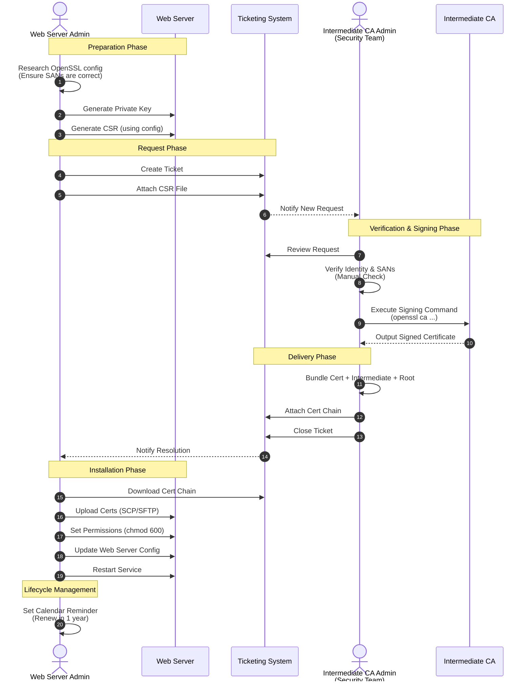
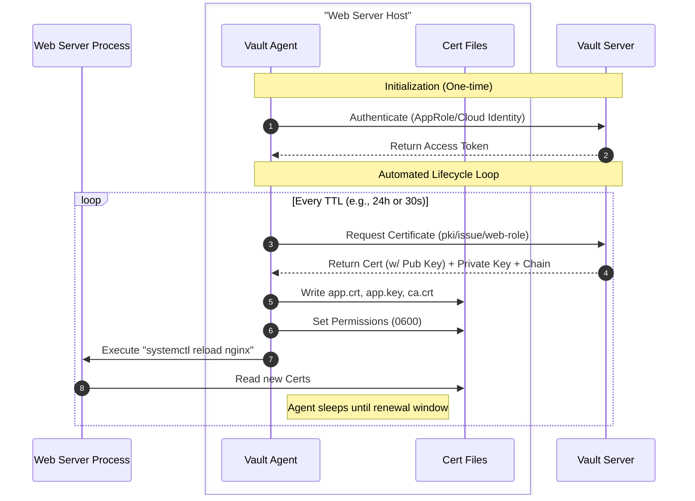

# Manual generation description

I am creating demo scenarios for PKI certificate generation with hashicorp Vault.  I want to illustrate how PKI TLS/Server cert has been generated and consumed in the traditional way using mermaid.  

It's a sequence flow chart, with parties: Intermediate CA admin, Web server (that needs a new TLS cert) admin, a ticketing system. It should contain the standard workflows like this:

 - **Preparation**: Web server admin creates an OpenSSL configuration file, ensuring Subject Alternative Names (SANs) are correctly defined.
 - **Key Generation**: Web server admin generates a private key and a Certificate Signing Request (CSR).
 - **Request**: Web server admin creates a support ticket, attaches the CSR, and assigns it to the Security Team.
 - **Verification**: Intermediate CA admin (Security Team) manually verifies the requester's identity and validates the requested SANs.
 - **Signing**: Intermediate CA admin runs the signing command to generate the certificate.
 - **Delivery**: CA admin attaches the signed certificate AND the full CA chain (Intermediate + Root) to the ticket.
 - **Installation**: Web server admin copies files to the server, sets secure permissions (e.g., `chmod 600`), and configures the web server.
 - **Activation**: Web server admin restarts/reloads the web server service.
 - **Lifecycle**: Web server admin sets a calendar reminder to renew the certificate in 1 year.

 The sequence flow chart should contain as much details as possible, we can always cutdown from there.

# Vault Generation Description (Automated)

In contrast to the manual process, the Vault workflow shifts the responsibility from humans to the **Vault Agent**. Once configured, the entire lifecycle is automated.

- **One-time Setup**: Admin installs Vault Agent and configures it with a role (e.g., AppRole) and a template.
- **Authentication**: Vault Agent automatically authenticates with Vault to obtain a token.
- **Request & Generation**: Vault Agent requests a certificate from the PKI engine. Vault generates the Key, Cert, and Chain instantly.
- **Delivery & Installation**: Vault Agent renders the certificate and private key directly to the file system with secure permissions (0600).
- **Activation**: Vault Agent automatically runs a `reload` command for the web server whenever the certificate changes.
- **Lifecycle**: Vault Agent monitors the certificate's TTL. When it reaches ~85% of its life, it **automatically renews** it. No tickets, no calendar reminders.

# Comparison Summary

| Feature | Manual Workflow | Vault Workflow |
| :--- | :--- | :--- |
| **Speed** | **Days/Hours** (Ticket queues, manual work) | **Milliseconds** (Instant API response) |
| **Human Effort** | **High** (10+ steps, multiple teams) | **Zero** (After initial setup) |
| **Security** | **Low** (Private keys often moved around, permissions errors) | **High** (Private key never leaves the host, generated in memory) |
| **Reliability** | **Low** (Forgot to renew = Outage) | **High** (Automated renewal, no outages) |
| **Scalability** | **Linear Effort** (More servers = More work) | **Infinite** (1000 servers is same effort as 1) |