# Manual generation description

I am creating demo scenarios for PKI certificate generation with hashicorp Vault.  I want to illustrate how PKI TLS/Server cert has been generated and consumed in the traditional way using mermaid.  

It's a sequence flow chart, with parties: Intermediate CA admin, Web server (that needs a new TLS cert) admin, a ticketing system. It should contain the standard workflows like this:

 - **Preparation**: Web server admin creates an OpenSSL configuration file, ensuring Subject Alternative Names (SANs) are correctly defined.
 - **Key Generation**: Web server admin generates a private key and a Certificate Signing Request (CSR).
 - **Request**: Web server admin creates a support ticket, attaches the CSR, and assigns it to the Security Team.
 - **Verification**: Intermediate CA admin (Security Team) manually verifies the requester's identity and validates the requested SANs.
 - **Signing**: Intermediate CA admin runs the signing command to generate the certificate.
 - **Delivery**: CA admin attaches the signed certificate AND the full CA chain (Intermediate + Root) to the ticket.
 - **Installation**: Web server admin copies files to the server, sets secure permissions (e.g., `chmod 600`), and configures the web server.
 - **Activation**: Web server admin restarts/reloads the web server service.
 - **Lifecycle**: Web server admin sets a calendar reminder to renew the certificate in 1 year.

 The sequence flow chart should contain as much details as possible, we can always cutdown from there.

# Vault Generation Description (Automated)

In contrast to the manual process, the Vault workflow shifts the responsibility from humans to the **Vault Agent**. Once configured, the entire lifecycle is automated.

- **One-time Setup**: Admin installs Vault Agent and configures it with a role (e.g., AppRole) and a template.
- **Authentication**: Vault Agent automatically authenticates with Vault to obtain a token.
- **Request & Generation**: Vault Agent requests a certificate from the PKI engine. Vault generates the Key, Cert, and Chain instantly.
- **Delivery & Installation**: Vault Agent renders the certificate and private key directly to the file system with secure permissions (0600).
- **Activation**: Vault Agent automatically runs a `reload` command for the web server whenever the certificate changes.
- **Lifecycle**: Vault Agent monitors the certificate's TTL. When it reaches ~85% of its life, it **automatically renews** it. No tickets, no calendar reminders.

```mermaid
sequenceDiagram
    autonumber
    participant Server as Web Server Process
    box "Web Server Host" #f9f9f9
        participant Agent as Vault Agent
        participant Files as Cert Files
    end
    participant Vault as Vault Server

    Note over Agent, Vault: Initialization (One-time Setup)<br/>[30-60 mins - Admin configures once]
    Agent->>Vault: Authenticate (AppRole/Cloud Identity)<br/>[<1 sec]
    Vault-->>Agent: Return Access Token<br/>[<1 sec]

    Note over Agent, Vault: Automated Lifecycle Loop<br/>[ZERO Human Effort]
    loop Every TTL (e.g., 24h or 30s)
        Agent->>Vault: Request Certificate (pki/issue/web-role)<br/>[~100 ms]
        Vault-->>Agent: Return Cert (w/ Pub Key) + Private Key + Chain<br/>[~100 ms]

        Agent->>Files: Write app.crt, app.key, ca.crt<br/>[<50 ms]
        Agent->>Files: Set Permissions (0600)<br/>[<10 ms]

        Agent->>Server: Execute "systemctl reload nginx"<br/>[~1 sec]
        Server->>Files: Read new Certs<br/>[<100 ms]

        Note right of Agent: Agent sleeps until renewal window<br/>[Zero human involvement]
    end

    Note over Agent, Vault: 🚀 TOTAL TIME PER RENEWAL: ~1-2 Seconds<br/>Human Effort: ZERO<br/>Fully Automated Forever
```

# Comparison Summary

| Feature | Manual Workflow | Vault Workflow |
| :--- | :--- | :--- |
| **Speed** | **Days/Hours** (Ticket queues, manual work) | **Milliseconds** (Instant API response) |
| **Human Effort** | **High** (10+ steps, multiple teams) | **Zero** (After initial setup) |
| **Security** | **Low** (Private keys often moved around, permissions errors) | **High** (Private key never leaves the host, generated in memory) |
| **Reliability** | **Low** (Forgot to renew = Outage) | **High** (Automated renewal, no outages) |
| **Scalability** | **Linear Effort** (More servers = More work) | **Infinite** (1000 servers is same effort as 1) |

# Cost Analysis (Based on AUD$50/hour)

## Manual Workflow Cost Breakdown

| Role | Task | Time | Cost |
| :--- | :--- | ---: | ---: |
| **Web Server Admin** | Research OpenSSL config | 20-30 mins | AUD$17-25 |
| **Web Server Admin** | Generate key + CSR | 15 mins | AUD$12.50 |
| **Web Server Admin** | Create ticket + attach CSR | 7 mins | AUD$6 |
| **CA Admin** | Review + verify identity/SANs | 15-25 mins | AUD$12.50-21 |
| **CA Admin** | Sign certificate + bundle | 10 mins | AUD$8 |
| **CA Admin** | Deliver via ticket | 5 mins | AUD$4 |
| **Web Server Admin** | Download + install + configure | 17-22 mins | AUD$14-18 |
| **Web Server Admin** | Set renewal reminder | 5 mins | AUD$4 |
| | **Total per certificate** | **1.5-2.5 hours** | **AUD$75-125** |

### Annual Cost for Different Fleet Sizes

| Fleet Size | Certificates/Year (1-year validity) | Annual Labor Cost |
| :--- | ---: | ---: |
| **10 servers** | 10 | AUD$750 - 1,250 |
| **50 servers** | 50 | AUD$3,750 - 6,250 |
| **100 servers** | 100 | AUD$7,500 - 12,500 |
| **500 servers** | 500 | AUD$37,500 - 62,500 |
| **1000 servers** | 1000 | AUD$75,000 - 125,000 |

### With Shorter TTL (90-day certificates - industry best practice)

| Fleet Size | Certificates/Year (90-day validity) | Annual Labor Cost |
| :--- | ---: | ---: |
| **10 servers** | 40 | AUD$3,000 - 5,000 |
| **50 servers** | 200 | AUD$15,000 - 25,000 |
| **100 servers** | 400 | AUD$30,000 - 50,000 |
| **500 servers** | 2000 | AUD$150,000 - 250,000 |
| **1000 servers** | 4000 | AUD$300,000 - 500,000 |

## Vault Workflow Cost

| Phase | Time | Frequency | Cost |
| :--- | ---: | :--- | ---: |
| **Initial Setup** (per server) | 30-60 mins | One-time | AUD$25-50 |
| **Certificate Renewal** | ~1-2 seconds | Automatic | **AUD$0** |
| **Ongoing Maintenance** | Minimal | Automated | **~AUD$0** |

### ROI Analysis

For a **100-server fleet** with **90-day certificate rotation**:

- **Manual Process**: AUD$30,000 - 50,000/year (ongoing)
- **Vault Initial Setup**: AUD$2,500 - 5,000 (one-time)
- **Vault Ongoing Cost**: ~AUD$0/year
- **First Year Savings**: AUD$25,000 - 45,000
- **Annual Savings (Year 2+)**: AUD$30,000 - 50,000

**Payback Period**: Immediate (first renewal cycle)